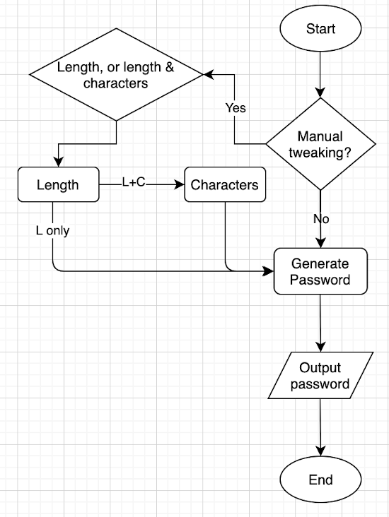
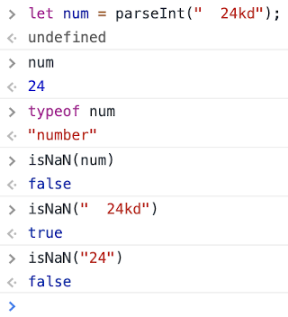

### Prompto

---

Prompto is a password generator that runs in the client environment. It generates a secure password according to the criteria specified by the user.

Prompto's web page follows a pre-established [mockup](./assets/pw-gen.png). The final product aims to present a clean and resonsive interface to the user. In this project, javascript code is incorporated to fulfill its functionality, making use of window pop-up boxes to interact with a user.

The completed project can be accessed here.

### Functionality

- When user clicks on the "generate password" button, there should be a series of prompts which direct user to specify their password criteria.

- The user has a choice whether to include a set of criteria (password length, character types) to their liking.

- If the password length option is chosen, the prompt will further request the length from the user, with a range between 8 and 128 characters.

- If the character types option is chosen together with length, a list of options including lowercase, uppercase, numeric and/or special characters should be presented to the user.

- After prompts are addressed, the password is generated to match corresponding criteria and is shown on the page.

### Implementation plan

Flowchart: 

#### Password design principle

A strong password should entail:

1. At least 8 characters, better if more
2. A mix of upper and lowercase letters
3. A mix of alphabets and numbers
4. At least one special character 

Therefore, whether or not the user decides to specify their own criteria, the generator always tries to do its best to generate a strong password.

If a user decides that no criteria are needed, the generator will assume the password to be 8 characters long. The password characters can be randomly decided and shuffled out of 10 predetermined patterns in an order of special characters, numbers, uppercase letters and lower case letters:

- [1, 1, 4, 2]
- [1, 1, 2, 4]
- [1, 1, 3, 3]
- [1, 2, 3, 2]
- [1, 2, 2, 3]
- [1, 2, 4, 1]
- [1, 2, 1, 4]
- [2, 2, 2, 2]
- [2, 3, 2, 1]
- [2, 3, 1, 2]

If a user only specifies the length of password, without detailing the number of special and numeric characters, uppercase and lowercase letters, the program will conduct a range screening, then work on generating the password based on the range.

For example, when the password length is between 8 and 16, the sequence of numbers for special character, numeric, uppercase letter are fixed as 1, 1, 2. The rest are lowercase letters. This is denoted as 'Range: 8 - 16, [1, 1, 2]'. All numbers go up proportionally. All 8 possible ranges are detailed as below:

- Range: 8 - 16, [1, 1, 2]
- Range: 17 - 32, [2, 2, 4]
- Range: 33 - 48, [3, 3, 6]
- Range: 49 - 64, [4, 4, 8]
- Range: 65 - 80, [5, 5, 10]
- Range: 81 - 96, [6, 6, 12]
- Range: 97 - 112, [7, 7, 14]
- Range: 113 - 128, [8, 8, 16]

If a user specifies both the length and the numbers of special character, numeric, uppercase letter and lowercase letter. Given that the sum of the numbers is equal to length and each number is greater than 0, the password will be generated according to user's specification.

#### Status update

parseInt() instroduced a subtle bug in this app earler on. parseInt() should be used with caution when converting string number into a number datatype. It can "mistakenly" convert invalid entry that contains other character types at rear. Therefore, valid input validation needs to be in force before using parseInt function. In the example below, the data has been entered as " 24kd", which is supposed to be "24" initially. After parseInt conversion, it completely masks the invalidity of the entry.

Meanwhile, '24' is considered a legal number in javascript. Interestingly, isNaN() is highly effective in screening out an illegal number within the string.  

